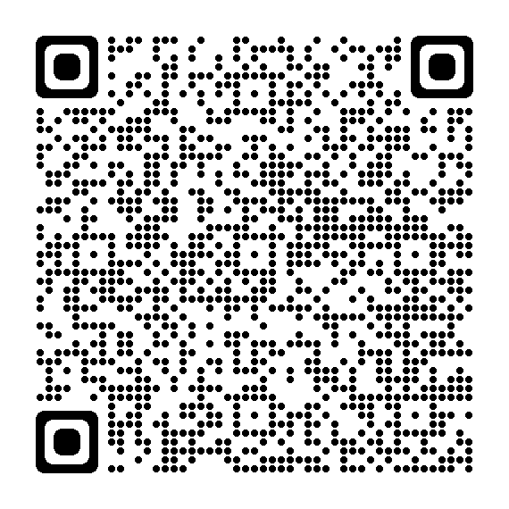

# Tiger Analytics - Azure OpenAI Hackathon

Welcome to the Azure OpenAI hackathon organized by Microsoft in partnership with Tiger Analytics. This repository contains information (data, instructions for the workshop, and reference material) related to **Setting RAG solutioning using Azure AI services** conducted by Microsoft and Tiger Analytics.

1. The sample data that will be used during the session is available in the [data](data) folder
2. The presentation that will be used during the session is available in the [references](references/AI_Build_Presentation.pdf) folder
3. Detailed instructions to follow during the session are available in the [instructions](instructions/ms_ai_build_steps.pdf) folder
4. Additional references can be found in the [references](references) folder. It also contains some sample Questions that can be asked on the dataset

Please feel free to reach out to the trainers during the session, for any questions or issues related to access or the
solution. We hope you have a rewarding experience during the hack event.

## Prerequisites

### Operating System

Windows and Linux are the preferred operating systems for the hack event. They're preferred as the tools and libraries are tested in Windows and Linux. Macbooks can be used if there are no alternatives, but challenges are to be expected.

### Python Environment

Python version **3.9** needs to be installed on the local machine used for the hack.
Refer to the instructions below to install Miniconda CLI and create a Python 3.9 environment.

1. Install Miniconda following the documentation (skip this step if you already have anaconda or miniconda installed): [https://docs.anaconda.com/free/miniconda/#quick-command-line-install](https://docs.anaconda.com/free/miniconda/#quick-command-line-install)
2. Please clone this GitHub repository to your local system or download the zip by clicking on the green **Code** button, then on the **Download Zip** button and selecting the folder to download the zip to your local machine. Once the repository gets downloaded, extract the zip file by right-clicking on the file and selecting the **Extract** button.
3. Create the conda virtual environment by running the following command in your terminal from the repository root:

```bash
    conda env create -n tiger_hack -f codes/deploy/conda.yaml
```

### Azure CLI

Azure CLI should be installed on the laptop to provide authentication to the Azure services.

1. Installation:
   Azure CLI can be installed by following the instructions in the below links:

   * Windows: [https://learn.microsoft.com/en-us/cli/azure/install-azure-cli-windows?tabs=azure-cli#install-or-update](https://learn.microsoft.com/en-us/cli/azure/install-azure-cli-windows?tabs=azure-cli#install-or-update)
   * Linux: [https://learn.microsoft.com/en-us/cli/azure/install-azure-cli-linux?pivots=apt#option-1-install-with-one-command](https://learn.microsoft.com/en-us/cli/azure/install-azure-cli-linux?pivots=apt#option-1-install-with-one-command)
   * Mac: [https://learn.microsoft.com/en-us/cli/azure/install-azure-cli-macos](https://learn.microsoft.com/en-us/cli/azure/install-azure-cli-macos)
2. Azure CLI Login:
   Execute the following commands in Powershell once Azure CLI is installed to log in to Azure using your credentials.

   ```bash
   az config set core.allow_broker=true
   az account clear
   az login
   ```

We greatly value your feedback and welcome any suggestions for improvement. Please share your thoughts [here](UPDATE LINK). You can also scan the QR code below to provide your feedback:

[](UPDATE LINK)

## Additional References
-  [Refer to this github repository](https://github.com/Azure/aistudio-copilot-sample)

**Note**: The Azure service accesses used in this event are only valid during the event. Please contact your respective Microsoft account teams to follow up on the continued access or further questions.
